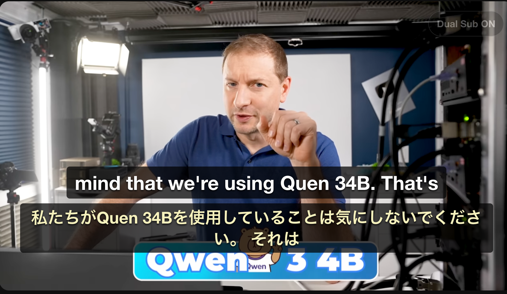

# My Tampermonkey Scripts

個人用の Tampermonkey userscript 置き場です。各 `.user.js` を Tampermonkey に登録して使います。

## Scripts

| Script | Target | Summary | Install |
| --- | --- | --- | --- |
| [YouTube Dual Subtitles](./youtube-dual-subtitles.user.js) | YouTube watch / embed pages | YouTube の元字幕と自動翻訳字幕を同時に表示する二重字幕オーバーレイ。デフォルトは英語字幕 + 日本語翻訳です。 | `youtube-dual-subtitles.user.js` を Tampermonkey に貼り付け |
| [Terminal Green Theme](./Terminal%20Green%20Theme-1.0.0.user.js) | All sites, except excluded domains | 全サイトを黒背景 + グリーン文字のターミナル風テーマに寄せる実験的なグローバルテーマ。 | `Terminal Green Theme-1.0.0.user.js` を Tampermonkey に貼り付け |

## YouTube Dual Subtitles



- 元字幕トラックと YouTube の `tlang` 自動翻訳トラックを同時に取得して表示します。
- 動画プレイヤー右上の `Dual Sub ON/OFF` ボタンで表示を切り替えられます。
- 設定はスクリプト先頭の `CONFIG` で変更できます。
- 詳細は [README.youtube-dual-subtiles.md](./README.youtube-dual-subtiles.md) を参照してください。

```js
const CONFIG = {
  originalLang: "en",
  translatedLang: "ja",
};
```

## Terminal Green Theme

- `@match *://*/*` の全体適用テーマです。
- `EXCLUDED_DOMAINS` に含めたドメインでは何もしません。
- UI を強く上書きするため、サイトによっては表示崩れや読みにくさが出る可能性があります。

```js
const EXCLUDED_DOMAINS = [
  "netflix.com",
  "figma.com",
];
```

## Install

1. Tampermonkey のダッシュボードを開きます。
2. 新規スクリプトを作成します。
3. 使いたい `.user.js` の内容を貼り付けます。
4. 保存して対象サイトを開きます。

